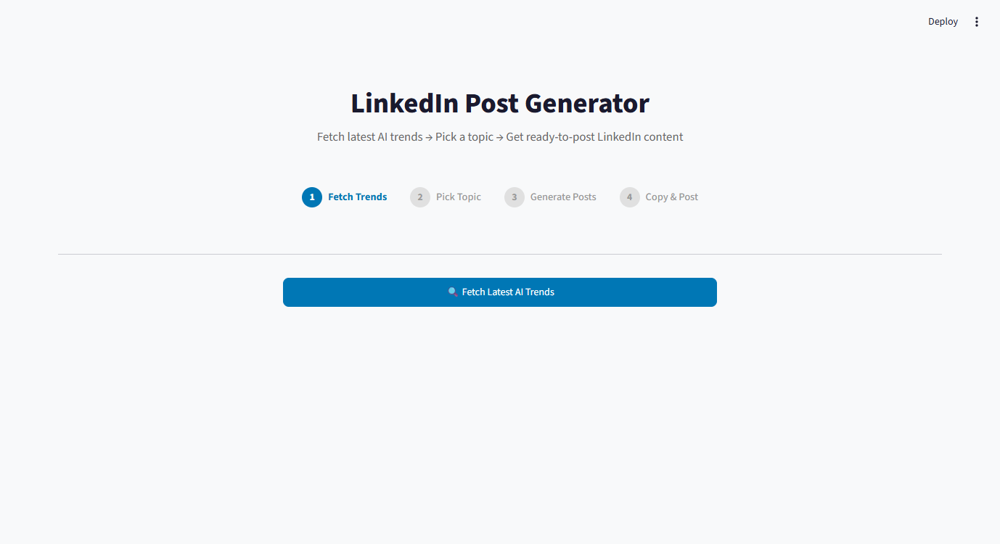
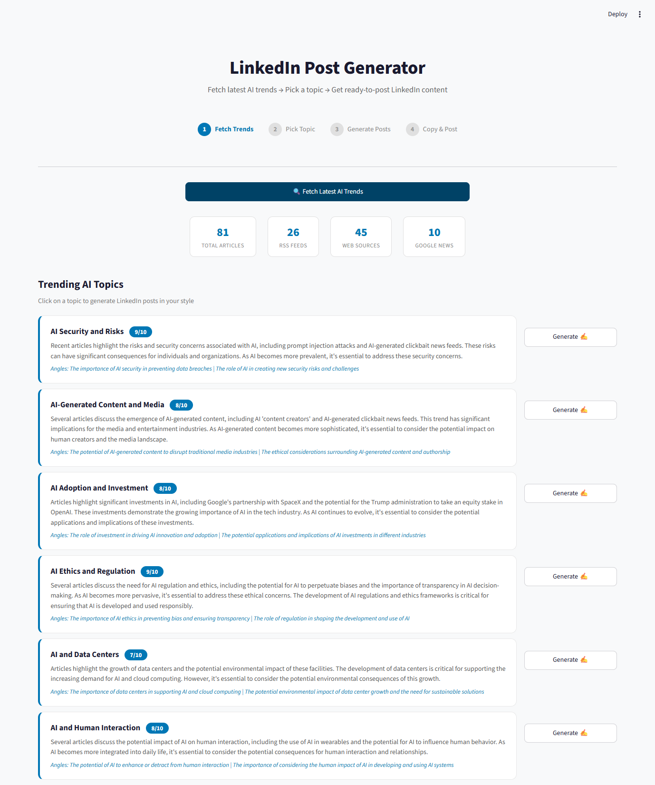
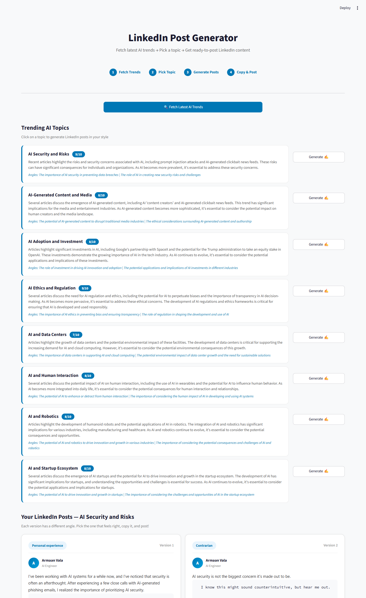

# LinkedIn Post Generator

An AI-powered tool that researches the latest AI/tech trends from 10+ sources and generates ready-to-post LinkedIn content in your personal writing style.

**Stop scrolling for ideas. Let AI do the research - you just post.**

---

## How It Works

The tool follows a simple 4-step flow:

### Step 1 - Fetch Latest Trends
Collects 70-80+ articles from multiple sources automatically:
- **RSS Feeds** - TechCrunch, The Verge, MIT Tech Review, VentureBeat, Google AI Blog, OpenAI Blog, Ars Technica
- **Hacker News** - Top AI/LLM stories via Algolia API
- **Reddit** - r/artificial, r/MachineLearning (via RSS)
- **Google News** - Real-time AI trend search

### Step 2 - AI Analyzes & Ranks Topics
Groq (Llama 3.3 70B) reads all articles and identifies the **top 8 most post-worthy topics**, grouped by theme, with a relevance score out of 10.

### Step 3 - Generate LinkedIn Posts
Pick any topic and get **4 different LinkedIn post versions**, each with a unique angle:
- Personal experience
- Contrarian / unpopular opinion
- Educational / "what most people miss"
- Industry impact / future prediction

### Step 4 - Copy & Post
Pick the version you like, copy it, and paste directly on LinkedIn.

---

## UI Preview

### Landing Page


### Trending Topics


### Generated Posts


---

## How to Run

### Prerequisites
- Python 3.10+
- A free [Groq API Key](https://console.groq.com)

### Setup

```bash
# Clone the repo
git clone https://github.com/armaan-vala/researched-and-linkedin-post-ideas.git
cd researched-and-linkedin-post-ideas

# Create virtual environment
python -m venv venv
venv\Scripts\activate        # Windows
# source venv/bin/activate   # Mac/Linux

# Install dependencies
pip install -r requirements.txt

# Add your API key
copy .env.example .env
# Edit .env and add: GROQ_API_KEY=your_key_here
```

### Run

```bash
# Web UI (Streamlit)
streamlit run app.py

# CLI mode
python main.py
```

The web app will open at `http://localhost:8501`

---

## Tech Stack

| Component | Technology |
|-----------|-----------|
| Frontend | Streamlit |
| AI Model | Llama 3.3 70B (via Groq) |
| Data Sources | RSS, HackerNews API, Reddit RSS, Google News RSS |
| Language | Python |

---

## Project Structure

```
├── app.py                 # Streamlit web UI
├── main.py                # CLI interface
├── config.py              # Sources, style prompts, settings
├── analyzer.py            # AI-powered trend analysis
├── post_generator.py      # LinkedIn post generation
├── sources/
│   ├── rss_feeds.py       # RSS feed fetcher
│   ├── web_scraper.py     # HackerNews + Reddit fetcher
│   └── google_news.py     # Google News fetcher
├── requirements.txt
├── .env.example
└── .streamlit/
    └── config.toml        # Light theme config
```

---

## License

MIT
